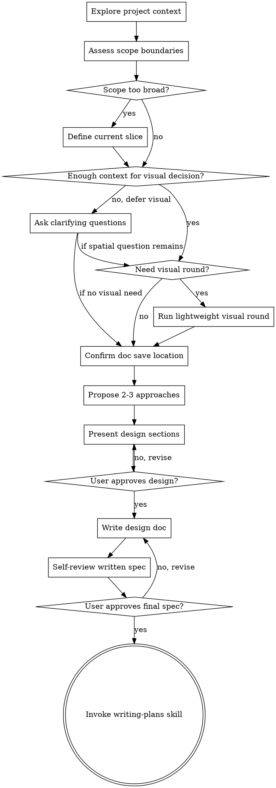

# Brainstorming Ideas Into Designs

## Overview

Help turn ideas into fully formed designs and specs through natural collaborative dialogue.

Start by understanding the current project context, then ask questions one at a time to refine the idea. Once you understand what you're building, present the design and get user approval.

<HARD-GATE>
Once this skill is active, do NOT invoke any implementation skill, write any code, scaffold any project, or take any implementation action until you have presented a design and the user has approved it.
</HARD-GATE>

## Anti-Pattern: "This Is Too Simple To Need A Design"

Do not skip the design pass just because the current request looks small. If this skill was invoked, the design can stay short (a few sentences for truly simple projects), but you still need to present it and get approval before implementation.

## Decision Gate

Signal candidates:
- The user explicitly asks to brainstorm, design, spec, compare options, or think before coding.
- The request could change product scope, UX, or flow, but the intended slice is still unclear.
- Multiple plausible approaches exist and a recommendation will affect downstream implementation.
- Layout, hierarchy, or page-flow questions may be easier to decide visually than textually.

Required evidence by claim type:
- **authority**: explicit user request for brainstorming/design/spec, or higher-priority instructions requiring design-first in this context.
- **relational**: project-context evidence that the request spans multiple subsystems/phases, or that a narrower current slice must be defined first.
- **semantic**: wording or artifacts from the user show the decision is spatial/visual rather than purely textual.
- **structural**: approved design sections and an approved written Markdown spec exist before invoking `writing-plans`.

Counter-evidence checks:
- If the user explicitly wants immediate implementation and no higher-priority instruction requires design-first, ask whether they want brainstorming or execution instead of forcing this skill.
- If the task is only implementation, bug fixing, or executing an already approved spec/plan, do not stay in brainstorming.
- If visual comparison would not help more than text, stay in terminal text mode.
- If evidence for scope, visual need, or recommendation quality is incomplete, ask one clarifying question before making a strong recommendation.

Decision rules:
- Signal without evidence -> ask one clarifying question or keep the conclusion `tentative`.
- A hard “brainstorm before implementation” block requires authority evidence; otherwise recommend brainstorming but allow clarification.
- “Scope too broad” decisions require relational evidence from the request + project context; otherwise keep the slice unresolved until clarified.
- Visual-branch decisions require semantic evidence plus minimum context: the current slice is known, the unresolved point is spatial/visual, and comparing options would help more than another text-only clarification. If any of those are missing, defer the visual question and keep clarifying in text.
- Once the minimum context is ready, treat non-trivial UI as an ask point: if the design already involves a genuinely complex surface (for example list/detail, multi-area layout, modal vs page, multiple states, or branching flow), explicitly ask whether the user wants a visual round. For trivial UI such as a simple confirmation dialog with no meaningful spatial alternatives, you may stay in text unless the user asks for visuals.
- HARD GATE — If the current slice is known, the target surface can be named, and the remaining uncertainty is spatial/visual, you MUST explicitly ask whether the user wants a lightweight visual round before confirming doc save location or proposing approaches. Do not continue in text silently.
- Approach recommendations require evidence from user goals, constraints, and trade-offs, plus a counter-check against the main downside of the recommended option.

## Behavioral Rules（行为准则）
These rules apply throughout the session and do not relax as the conversation grows:
1. ❗ Stay in brainstorming/design mode until both approval gates pass. Self-check before every response.
2. ❗ Base scope cuts, recommendations, and visual-branch decisions on current-project evidence, user answers, and approved artifacts. If evidence is incomplete, keep the conclusion `tentative` or `unresolved` and ask one clarifying question. Self-check before every response.
3. ❗ Keep the interaction lean: ask at most one clarifying question per turn, present at most 2-3 approaches, and do not expand into implementation details unless the user explicitly asks. Self-check before every response.

## Tool Priority

| Operation | Preferred tool | Fallback trigger | Fallback |
|---|---|---|---|
| Ask a clarifying question | `AskUserQuestion` | The question cannot be expressed cleanly in one tool prompt, or the tool is unavailable | Ask one plain-text question, then return to `AskUserQuestion` next turn |
| Read a known project artifact | `Read` | The exact path is unknown | `Glob` -> `Read` |
| Find candidate files | `Glob` | A small set of exact paths is already known | Read those exact files directly |
| Search project text | `Grep` | The search scope is already narrowed to 1-2 known files | Read those files directly |
| Visual decision support | Follow `references/visual-companion.md` | The decision is not spatial/visual after all | Stay in terminal text mode |

- One failed attempt does not justify switching tools; narrow scope and retry once first.
- Do not skip from brainstorming into implementation because a search/read step felt slow.

## Output Constraints（输出约束）
Do not output:
- Warm-up phrases or tool narration
- Repeating already-established context
- More than one clarifying question per turn
- More than 3 approaches or cosmetic variants
- Implementation tasks before the design and written-spec gates pass
- Visual output defaults to low-fidelity SVG (saved to a temp file and opened for the user); do not use ASCII for spatial/UI comparisons. Do not produce polished or high-fidelity visuals unless the user explicitly asks for them.

## Dependency Chain（依赖链）
- Step 6 input = Step 5 resolved questions + `visual_mode != deferred`; Step 8 input = Step 7 approved sections + `approved_doc_path_count == 1`; Step 10 input = Step 9 reviewed spec; Step 11 input = `approval_gates_passed == 2`.
- Reuse the last confirmed constraints instead of regenerating decisions from memory.
- The full dependency contract and cross-check equations live in `references/execution-guide.md`.

## Evidence & Hallucination Guardrails（幻觉防护）
- Strong recommendations, scope cuts, and visual-branch decisions must be traceable to current-project context, user answers, or approved artifacts.
- No source -> keep the conclusion `tentative` / `unresolved`, not final.
- If reads/searches return nothing useful, state what is missing instead of inventing project facts.
- Zero-result handling and label rules live in `references/execution-guide.md`.

## Checklist

You MUST create a task for each of these items and complete them in order:

1. **Explore project context**
2. **Assess scope boundaries**
3. **Decide whether a visual round helps（信息不足时先显式 defer）**
4. **Confirm doc save location**
5. **Ask clarifying questions**
6. **Propose 2-3 approaches**
7. **Present design**
8. **Write design doc**
9. **Self-review written spec**
10. **Get final spec approval**
11. **Transition to implementation**

Read `references/execution-guide.md` for the required checkpoints, completion equations, and failure paths for these 11 steps.

## Process Flow

**The terminal state is invoking writing-plans (if available).** Do NOT invoke frontend-design, mcp-builder, or any other implementation skill. If the writing-plans skill is available, it is the ONLY skill you invoke after brainstorming. Before reaching that terminal state, you MUST pass two gates: (1) the user has approved the design sections in conversation, and (2) the user has approved the final written Markdown spec after your self-review. Visual草稿只是辅助理解，不是 approval 本身。If writing-plans is NOT available, end gracefully after the final written spec is approved, the design doc is committed, and the user is informed the design is ready for implementation.

## The Process

- Start from current project context, not from assumptions.
- Ask clarifying questions with `AskUserQuestion`, one per turn.
- If the request spans multiple low-coupling subsystems or phases, narrow this round to one slice before going deeper.
- If the user asks to rewrite an existing design doc, or if entrance/game-system/doc-trap signals appear, read `references/questioning-guide.md` and apply only the relevant probes.
- If the direction feels vague or the solution space is large, use 1-2 techniques from `references/techniques.md`.
- If the request already includes UI/page/dialog/list/detail/navigation elements, **or if the user has attached screenshots, mockups, or reference images, or if the system being designed renders visible on-screen elements (overlays, highlights, rings, text boxes, etc.)**, do not jump straight to a visual round. First confirm the current slice and name the unresolved point. Once that minimum context exists, check UI complexity: if this round already involves a non-trivial surface (such as list/detail, multi-area layout, modal vs page, multiple states, a branching flow, or multiple on-screen elements whose spatial relationship is a design decision) and the remaining uncertainty has **any** spatial/visual dimension, ask once whether the user wants a visual round; if yes, read `references/visual-companion.md`, otherwise stay in terminal text mode. For trivial UI such as a simple confirmation dialog with no meaningful layout trade-off, stay in text unless the user explicitly wants visuals. **Important: a request can have a primary non-visual concern (e.g. config structure) while also having a secondary visual concern (e.g. how on-screen elements relate spatially) — both should be addressed; do not let the primary concern suppress the visual question.**
- Default visual-round question: 「这个点你更想直接用文字定，还是我先给你 2-3 个轻量草图 / ASCII 方案再定？」
- If the user explicitly asks for 草图 / ASCII / wireframe / 2-3 options at any point, set `visual_mode=yes` immediately for the currently named surface and run one lightweight visual round.
- Propose 2-3 approaches when multiple options are genuinely viable, and evaluate each from **技术 / UX / 商业 / 边界情况**.
- Present the design in sections scaled to complexity, get approval as you go, then draft the Markdown spec.
- Only add implementation-oriented sections such as architecture, data flow, error handling, or testing when the user explicitly asks for them.

**Design doc source of truth:**

Read `references/design-doc-template.md` before drafting. That template is the only source of truth for the Markdown document structure, required sections, formatting rules, and examples.

Do not redefine document sections in `SKILL.md`. If you need exact structure, required subheadings, or formatting details, load the template instead of improvising.

## After the Design

**Documentation:**
- Write the validated design draft to the path confirmed with the user in step 4 of the Checklist
- Read `references/design-doc-template.md` and follow its structure when writing the design doc.
- If visual草稿帮助过收敛方案，可在文档中引用其结论，但不要让临时视觉工件替代 Markdown 设计文档本身。
- Before showing the written spec to the user, run a self-review pass and fix issues inline. At minimum, check for: placeholders/TODO/TBD, contradictions, ambiguous requirements, unrequested scope expansion, and whether the spec is still small enough to feed into a single implementation plan.
- Show the final written Markdown doc to the user and explicitly ask whether it accurately reflects the design already approved in conversation. Presentation approval is NOT enough; the written spec needs its own confirmation gate.
- Only after the user approves the written spec, commit the design document to git

**Implementation:**
- Invoke the writing-plans skill to create a detailed implementation plan
- Do NOT invoke any other skill. writing-plans is the next step.

## Key Principles

- **Design before implementation** - Once brainstorming is active, stay out of implementation until the design and written spec gates are both passed.
- **Scope tightly** - If the request spans multiple slices, define the slice for this round before deep design work.
- **Use evidence, not instinct** - Recommendations, scope cuts, and visual branches should follow the Decision Gate, not vibes.
- **Keep the design lean** - Remove unnecessary features and avoid implementation-level detail unless the user explicitly asks for it.
- **Validate twice** - First validate the design in conversation, then validate the written Markdown spec before planning or committing.
- **Revise when facts change** - If new information contradicts the current design, go back, correct it, and continue from the updated state.
