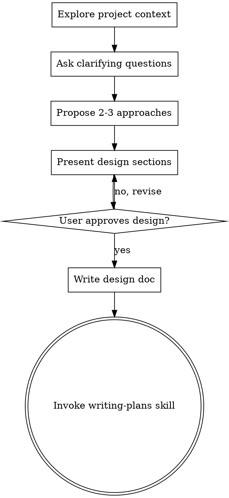

# Brainstorming Ideas Into Designs

## Overview

Help turn ideas into fully formed designs and specs through natural collaborative dialogue.

Start by understanding the current project context, then ask questions one at a time to refine the idea. Once you understand what you're building, present the design and get user approval.

<HARD-GATE>
Do NOT invoke any implementation skill, write any code, scaffold any project, or take any implementation action until you have presented a design and the user has approved it. This applies to EVERY project regardless of perceived simplicity.
</HARD-GATE>

## Anti-Pattern: "This Is Too Simple To Need A Design"

Every project goes through this process. A todo list, a single-function utility, a config change — all of them. "Simple" projects are where unexamined assumptions cause the most wasted work. The design can be short (a few sentences for truly simple projects), but you MUST present it and get approval.

## Checklist

You MUST create a task for each of these items and complete them in order:

1. **Explore project context** — check files, docs, recent commits
2. **Confirm doc save location** — 用 `AskUserQuestion` 询问用户设计文档保存到哪里，记录确认的路径，后续写文档时使用
3. **Ask clarifying questions** — one at a time, understand purpose/constraints/success criteria
4. **Propose 2-3 approaches** — with trade-offs and your recommendation
5. **Present design** — in sections scaled to their complexity, get user approval after each section. 必须包含：产品范围、用户旅程、功能需求
6. **Write design doc** — save to the path confirmed in step 2 and commit
7. **Transition to implementation** — invoke writing-plans skill to create implementation plan (if available; otherwise end gracefully)

## Process Flow



**The terminal state is invoking writing-plans (if available).** Do NOT invoke frontend-design, mcp-builder, or any other implementation skill. If the writing-plans skill is available, it is the ONLY skill you invoke after brainstorming. If writing-plans is NOT available, end gracefully after committing the design doc and inform the user the design is ready for implementation.

## The Process

**Understanding the idea:**
- Check out the current project state first (files, docs, recent commits)
- 检查用户提供的上下文中是否包含界面流转相关信息（线框图、流程图、竞品截图分析等）。如果完全没有，在开始提问前**主动提示**用户：可以新开一个对话，把竞品截图或录屏作为输入，先让 Claude 分析出界面流转结构，再把分析结果带回来作为本次 brainstorming 的输入背景——这样产出的设计文档会更有参照依据。这只是建议，用户也可以选择直接继续。

**改写既有文档时的全量差距核查：**

当用户提供的是一份已有设计文档，要求按规格改写时，在动笔之前必须完成以下逐项核查。不要只做浅层扫描——每一项都要对比 `references/design-doc-template.md` 的结构和示例，才算核查完毕。

| 章节 | 核查要点 |
|------|---------|
| 产品范围 | 是否包含「设计目的」和「系统概述」两个子标题？ |
| 用户旅程 | 每条旅程是否有①界面流转示意（ASCII）②关键步骤表格？缺一不可 |
| 用户旅程 | 旅程内容是否含"目标"/"前置条件"等元数据字段？有则删除 |
| 功能需求 | 是否按模块拆分为小节展开描述（如「模块一：XXX」）？ |
| 功能需求 | 是否按两步法推导：先从用户旅程归纳，再补入数值、限制、生命周期、边界情况等系统内在逻辑？ |
| 功能需求 | 各模块描述是否覆盖了用户旅程中的功能点？ |
| 功能需求 | 是否有「红点和提醒」固定子模块？本系统明确无红点时写「无」即可，不可省略 |
| 配置结构 | 是否列出本功能涉及的配置表？每张表是否说明了职责和需要配置的内容项？是否避免了给出具体表名和字段名？ |
| 决策记录 | 产品范围中写了 out-of-scope 的事项，是否都在决策记录里有对应条目？ |

核查完成后，向用户报告差距清单（哪些章节缺失/格式不符），并确认改动方向再动笔——不要自行假设和直接改写。

- Ask questions one at a time to refine the idea using the **`AskUserQuestion` tool** — this gives the user a structured, easy-to-answer interface
- Prefer multiple choice questions (use the `options` field); open-ended is fine when choices can't be enumerated
- **CRITICAL: Only one question per `AskUserQuestion` call.** Wait for the user's answer before asking the next question. Never batch multiple questions together.
- If a topic needs more exploration, break it into a sequence of separate `AskUserQuestion` calls across multiple turns
- Focus on understanding: purpose, constraints, success criteria

**入口感知（贯穿整个提问阶段）：**

入口是用户进入功能的所有路径——主入口往往显而易见，但额外的入口（二级路径、推送跳转、其他界面的快捷按钮等）很容易在对话中被遗漏，等到设计落地后才被发现，代价很高。所以在整个提问阶段，你都需要主动侦听入口信号。

当用户的表述中出现以下信号时，立即用一条 `AskUserQuestion` 追问：

- **场景词**：「结算后」「完成任务后」「收到通知/Push」「活动入口」「从其他界面跳转」「快捷方式」
- **状态词**：「红点点击进来」「弹窗引导」「系统提示」「新手流程结束后」
- **位置词**：「大厅」「主界面」「底栏」「悬浮球」「邮件」「公告」
- **数量暗示**：「主要入口是 X，但也可以从 Y 进」「一般都走 X 流程」（"一般"暗示有例外路径）

追问方式——直接、具体，例如：

- 「你提到结算界面，那从结算界面是否可以直接跳转进入本功能？」
- 「Push 通知点击后会落在哪个界面？」
- 「除了大厅主入口，是否有其他界面也有进入本功能的快捷按钮？」

将所有确认的入口（含主入口）记录在对话草稿中，写设计文档时在功能需求模块中体现入口信息。

**游戏策划领域检查项：**

当设计对象是游戏系统时，在提问阶段额外确认以下事项。这些是游戏策划文档中容易遗漏但对实现影响大的细节，不要假设用户会主动提及——主动追问。

- **红点提醒**：本系统是否有红点/角标提示？如果有，确认：哪些状态触发红点？红点出现在哪些入口？消除条件是什么？是否需要穿透到上级入口（如大厅图标）？是否有邮件/Push 通知？收集到的答案写入设计文档「功能需求 → 红点和提醒」子模块。
- **新手引导**：玩家首次进入本系统时是否需要引导？如果有，确认引导覆盖哪些操作；如果没有，说明原因。收集到的答案写入对应界面/流程模块，或独立成「新手引导」模块；明确不涉及时记录到决策记录。
- **经济影响**：本系统是否涉及游戏内货币产出或消耗？如果有，确认对整体经济的影响预期。收集到的答案写入功能需求中的数值/奖励/经济模块；明确不涉及时记录到决策记录。

每个检查项用一条 `AskUserQuestion` 追问，不要批量提问。如果用户明确表示"本系统不涉及"或"后续再定"，记录到决策记录中，不再追问。
**文档陷阱探针（提问阶段同步介入）：**

设计文档中存在九类高频缺陷，在澄清问题阶段提前追问可以直接预防，远比写完文档再修正代价低。以下每类缺陷都有明确的触发信号——一旦信号出现，立即用一条 `AskUserQuestion` 介入，不要等到设计章节动笔后。

**类型一：流程描述与底层机制脱节**
触发信号：用户描述"玩家完成操作后回来看进度"、"重新打开界面看到结果"等，隐含了需要主动刷新才能看到更新的假设。
追问方向：「这个进度/状态是实时推送到界面，还是需要玩家重新打开才能看到？」

**类型二：规则遗漏（整块缺失）**
触发信号：用户描述了一个有多个阶段、轮次或周期的机制，但没有提及它与周期重置的交互关系。
追问方向：「周期重置时，这个[链式/轮式/多阶段]机制从哪里重新开始？进度如何处理？」

**类型三：边界场景未覆盖**
触发信号：任何由服务器触发的异步事件（周期重置、活动到期、状态变更），或用户只描述了"玩家下次登录时"的体验。
追问方向：「如果玩家正在界面上时这个事件发生，界面会即时刷新还是等下次打开才更新？有没有预警提示？」

**类型四：只定义正向、遗漏反向**
触发信号：用户定义了"满足条件 A 时怎样"，但没有提及"不满足条件 A 时怎样"；或规则只说了共享/不共享的一面。
追问方向：「[不满足该条件 / 条件类型不同] 时，系统的行为是什么？」

**类型五：措辞歧义（缺少限定语）**
触发信号：用户使用「各自」「分别」「独立」「每个」等词，但没有说明各自的具体标准是什么，或两档/两类共用同一规则还是各有不同。
追问方向：「这里的"各自"是指按同一套规则，还是[两档/两类]有不同的标准？」

**类型六：内部矛盾（同一机制多处描述不一致）**
触发信号：对话中同一个机制前后表述出现细微差异（如先说"可折叠"后说"始终展开"），或用户修正了之前的表述。
处理方式：不要继续推进——整理当前已确认的所有相关描述，一条 `AskUserQuestion` 让用户确认哪个版本是准确的，再继续后续提问。

**类型七：列表/网格排序规则未定义**
触发信号：设计中出现列表、网格、排行、背包、任务队列等有序展示的内容，但用户没有说明排列依据。
追问方向须覆盖以下几点（可分多轮追问）：
- 初始排序依据是什么（时间、等级、配置字段、玩家行为等）？
- 是否有多档优先级（如"可操作的优先，档内再按 X 排"）？
- 某条目的状态变化（如完成、解锁、过期）是否会触发它在列表中的位置变化？
- 若同时有多条满足同一置顶/置底条件，相互之间的顺序如何？

**类型八：带更新周期内容的跨周期表现**
触发信号：设计中出现"每日/每周/每月刷新"、"限时活动"、"版本内容"等有明确生命周期的内容。
追问方向须覆盖以下几点（可分多轮追问）：
- 周期结束时，未完成/未领取的内容如何处理（保留进度、清零、奖励作废）？
- 玩家**在线时**恰好经历周期切换，界面是实时刷新还是等下次打开才更新？有无弹窗或 Toast 提示？
- 周期切换前是否有倒计时预警（如"还剩 X 小时"）？
- 跨段式内容（如链式/轮式任务、分阶段活动）遭遇周期重置时，从哪个阶段重新开始？

**类型九：奖励/道具展示的悬停交互**
触发信号：设计中出现奖励图标列表、道具预览、礼包展示等任何以"图标 + 数量"形式呈现物品的内容（如任务奖励预览、商城道具格、活动奖励栏、预览弹窗中的奖励区），但用户没有说明图标的交互行为。
追问方向：「这些奖励/道具图标是否需要支持悬停（或点击）显示通用 Tip（如道具名称、品质、简介等）？如果需要，是复用全局道具悬停规范，还是单独定义？」

每类探针用一条独立的 `AskUserQuestion` 追问，不批量合并。如果用户的回答已经覆盖了某类探针的信息，则跳过不重复追问。

- When the user's direction feels vague or the problem space is large, use one of these techniques to help explore:
  - **第一性原理**：抛开现有实现，从根本需求出发重新推导
  - **反转法**：先想「怎么让这个功能完全失败」，再反推解法
  - **SCAMPER**：替换/合并/改编/放大/缩小/他用/消除现有设计元素
  - **类比思维**：这个问题在其他领域（游戏/电商/社交）是怎么解的

  More techniques available in `references/techniques.md` if needed.

**Exploring approaches:**
- Propose 2-3 different approaches with trade-offs
- Present options conversationally with your recommendation and reasoning
- Lead with your recommended option and explain why
- For each approach, evaluate from **4 angles** to avoid single-perspective bias:
  - **技术**：实现复杂度、架构影响、可维护性
  - **UX**：用户体验、交互复杂度、学习成本
  - **商业**：开发成本、维护成本、长期价值
  - **边界情况**：失败场景、异常处理难度、扩展风险

**Presenting the design:**
- Once you believe you understand what you're building, present the design
- Scale each section to its complexity: a few sentences if straightforward, up to 200-300 words if nuanced
- Ask after each section whether it looks right so far
- If the output is a GDD / game design document, follow the required design sections below as the source of truth
- Only add architecture, components, data flow, error handling, or testing sections when the user explicitly asks for implementation-oriented design
- Be ready to go back and clarify if something doesn't make sense

**必含设计章节：**

设计文档必须包含以下章节。它们不是可选项——它们构成下游验证和实现所依赖的追溯链。省略它们会导致 Critical 级别的缺陷，需要返工。

1. **产品范围** — 固定包含两个子标题：
   - **设计目的**：说明要解决什么问题、功能定位
   - **系统概述**：说明给谁用、明确不在本次范围内的内容

   成功标准等量化指标只在用户明确提出时才写入，不要凭空编造。

   原因：没有独立的产品范围章节，这些信息散落在设计中，下游验证无法引用。设计目的和系统概述是最核心的两类信息，拆开书写可让读者快速定位。

2. **用户旅程** — 定义2-5条覆盖功能主要路径的核心用户旅程。每条旅程**不需要**「目标受众」「用户目标」「前置条件」等元数据字段——直接进入内容本体。

   每条旅程固定结构如下（顺序不可颠倒）：

   1. **界面流转示意**（ASCII 图）— 先呈现，帮助读者建立感官认知。绘制规范：
      - 用 `┌──┐` 框出每个界面，框内列出主要区域、按钮和关键信息
      - 用 `│ ▼` 表示主流程向下流转，用 `├──┐` 展开侧向分支
      - 触发条件写在箭头旁（如"点击确认""匹配成功"）
      - 流转路径和界面内容合在一张图里，不要拆成"流程图 + 独立线框"两份——开发和设计对"这是弹窗还是跳转全屏""这个界面里有哪些区域"的问题应在同一张图里得到答案
      - **折叠包裹**：整个 ASCII 流程图必须用 `<details>` 标签包裹，默认收起。格式要求：
        - `<details>` 标签后紧跟 `<summary>` 行，中间不留空行
        - `</summary>` 后紧跟图内容，中间不留空行
        - 图内容与 `</details>` 之间不留空行
        - 图内部各行之间也不要出现完全空白的行（用带空格的行或直接连续排列）
        - 这样做是因为部分 Markdown 渲染引擎会将 `<details>` 块内的空行解释为块结束，导致渲染错误
   2. **关键步骤**（表格）— 列出步骤编号、玩家操作、系统响应、决策点
   3. 分支流程 / 失败路径（按需保留）

   示例：

   ```
   ### UJ-01: 排位赛流程

   <details>
   <summary>界面流转示意（点击展开）</summary>
   大厅（底栏赛事入口）
       │
       ▼
   ┌──────────────────────────┐
   │  排位模式选择              │
   │  [街头3v3] [5v5] [1v1]  │
   └────────────┬─────────────┘
                │ 确认
                ▼
           匹配等待 → 选人 → 比赛 → 结算 → 大厅
   </details>

   **关键步骤**:

   | # | 步骤     | 玩家操作         | 系统响应               | 决策点         |
   |---|----------|-----------------|----------------------|---------------|
   | 1 | 进入排位  | 点击赛事入口      | 展示排位模式选择        | -             |
   | 2 | 选择模式  | 点击「街头3v3」   | 进入匹配等待界面        | 是否继续匹配？  |
   | … | …        | …               | …                    | …             |
   ```

   原因：用户旅程是功能需求的来源依据。没有它们，无法验证需求是否必要，也无法发现遗漏的关键交互。先放界面流转图让读者先建立空间感，再看关键步骤表格时理解更快。

3. **功能需求** — 按功能模块拆分为小节展开描述（如「模块一：任务列表界面」「模块二：任务条件组」），每个模块用自由段落描述功能需求，只描述能力（WHAT），不描述实现（HOW）。不需要 FR-ID 编号表格，也不需要来源列追溯 UJ 编号。

   **模块推导逻辑（两步法）：**
   第一步：**从用户旅程归纳** — 遍历所有用户旅程的关键步骤表，提取每个步骤中涉及的「系统响应」和「决策点」，按内聚性分组。分组原则：被同一条或多条紧密关联的旅程共同触发的功能点归入同一模块。例如 UJ-01 的"匹配→比赛"和 UJ-02 的"查看战绩→段位变更"分属不同交互链路，应拆为两个模块；而 UJ-01 和 UJ-03 都涉及"排位模式选择"，则归入同一模块。
   第二步：**补入系统内在逻辑** — 第一步只覆盖了用户可感知的交互功能，但系统运转还需要一些用户不直接操作但必须定义的规则和机制。将提问阶段收集到的以下类型信息，按主题归入已有模块或独立成新模块：
   - 数值与计算规则（价格、费用、奖励、系数）
   - 限制与上限（次数、数量、时段）
   - 数据生命周期与状态流转（周期重置、过期处理、状态机转换）
   - 边界情况（异常失败、并发冲突、降级策略）
   判断标准：如果某个规则只服务于一个交互模块（如"每日购买次数上限"只服务于购买模块），直接写入该模块；如果跨模块共用（如"周期重置影响所有进度"），独立成模块。
   「红点和提醒」是固定子模块，无论系统是否有红点都必须保留，始终作为最后一个模块。**模块内必须包含以下固定子章节**（如某项无内容，写「无」即可，不可省略子章节）：
   - **红点**（`####` 二级标题）：红点相关规则的统一父节
     - **触发条件**（`#####` 三级标题）：哪些状态产生红点
     - **位置与层级**（`#####` 三级标题）：出现在哪些入口，是否穿透到上级，消除条件是什么
   - **邮件通知**（`####` 二级标题）：触发场景、推送内容、触发时机（如系统无邮件通知，写「无」）
   - **Push 通知**（`####` 二级标题）：触发场景、推送内容、触发时机（如系统无 Push 通知，写「无」）

   原因：模块化展开比编号表格更易理解功能全貌，策划和开发可以按模块独立阅读和实现。用户旅程已在第 2 章节完整描述，功能需求无需重复标注来源。两步推导法确保模块既有交互依据（不凭空发明），又不遗漏用户不可见但对实现必要的规则。

4. **配置结构** — 列出本功能涉及的所有配置表，说明每张表的职责和需要配置的内容项。帮助策划、客户端和服务器对齐"谁配什么"，避免遗漏或重复配置。

   注意：设计文档中**不要**给出具体的表名（如 PlayerRankConfig）和字段名（如 rank_id），只描述表的用途和需要配置哪些信息。具体命名是开发阶段的事，设计案只负责定义"需要配什么"。

   格式：**粗体用途描述** + 冒号，换行用 bullet list 列出需要配置的内容项（用自然语言描述）。示例：

   ```
   **排位段位配置：**
   - 各段位的门槛分数
   - 晋级下一段位所需分数
   - 段位名称和图标

   **对战奖励配置：**
   - 各游戏模式的胜利奖励
   - 各游戏模式的失败奖励
   ```

   如果功能完全不涉及配置表（如纯 UI 交互），仍保留「配置结构」章节，并写「无配置表」。

5. **决策记录** — 记录设计过程中的关键决策，包括已决和待决。待决项与「待讨论事项」关联。

6. **待讨论事项** — 需跨部门对齐或尚未决策的开放问题。所有决策已锁定时写"无"即可。

## After the Design

**Documentation:**
- Write the validated design to the path confirmed with the user in step 2 of the Checklist
- Read `references/design-doc-template.md` and follow its structure when writing the design doc. The template defines the required sections (产品范围、用户旅程、功能需求、配置结构、决策记录、待讨论事项) with filling guidance and examples for each.
- Commit the design document to git

**Implementation:**
- Invoke the writing-plans skill to create a detailed implementation plan
- Do NOT invoke any other skill. writing-plans is the next step.

## Key Principles

- **`AskUserQuestion` tool required** - Always use the `AskUserQuestion` tool when asking clarifying questions, not plain text
- **One question per turn** - Ask one question, wait for the answer, then ask the next. Never send multiple questions in one turn.
- **Multiple choice preferred** - Use the `options` field in `AskUserQuestion`; easier to answer than open-ended when possible
- **YAGNI ruthlessly** - Remove unnecessary features from all designs
- **Explore alternatives** - Always propose 2-3 approaches before settling
- **Incremental validation** - Present design, get approval before moving on
- **Be flexible** - Go back and clarify when something doesn't make sense
