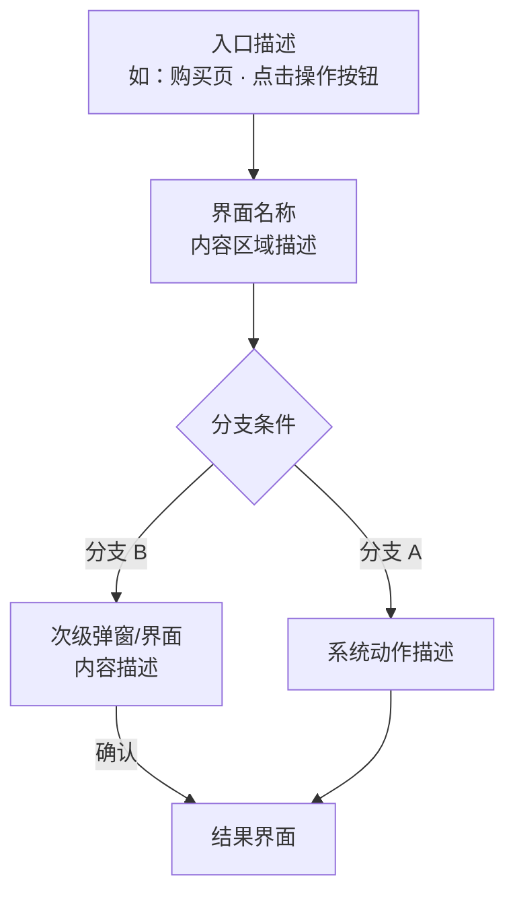
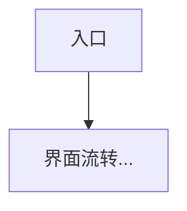

# 设计文档模板

brainstorming 技能在"Write design doc"阶段必须读取此模板，按模板结构产出设计文档。

---

```markdown
# [功能名称] 设计文档

## 产品范围

### 设计目的

<!-- 说明要解决什么问题、功能定位 -->

### 系统概述

<!-- 给谁用、明确不在本次范围内的内容。
  如果用户在提问阶段提供了成功标准或量化目标，自然地写进这段；如果没有，不要凭空编造。-->

---

## 用户旅程

<!-- 定义2-5条核心用户旅程，覆盖功能的主要路径 -->
<!-- 每条旅程不需要「目标受众」「用户目标」「前置条件」等元数据字段，直接进入内容本体 -->
<!-- 固定结构顺序（不可颠倒）：① 界面流转示意 → ② 关键步骤 → ③ 分支/失败路径（按需） -->
<!-- 界面流转示意格式要求：
  - 使用 mermaid flowchart 表示流程，目的是示意流程走向，而非界面布局
  - 节点文字换行使用 <br/> 而不是 \n
  - 分支用菱形节点（{}）表示
  - 保持节点文字简洁，每个节点描述一个状态或动作 -->

### UJ-01: [旅程名称]

<!-- 以下仅为 mermaid 流程示意的格式示例，节点结构和分支按实际需求设计，不必照搬 -->


**关键步骤**:

| # | 步骤 | 玩家操作 | 系统响应 | 决策点 |
|---|------|---------|---------|-------|
| 1 | ...  | ...     | ...     | ...   |
| 2 | ...  | ...     | ...     | ...   |

### UJ-02: [旅程名称]

<!-- 格式同 UJ-01：mermaid flowchart，节点换行用 <br/>，不用 \n -->


**关键步骤**:

| # | 步骤 | 玩家操作 | 系统响应 | 决策点 |
|---|------|---------|---------|-------|
| 1 | ...  | ...     | ...     | ...   |

---

## 功能需求

<!--
  每个小节用自由段落描述该模块的功能需求，只描述能力(WHAT)，不描述实现(HOW)。
  按功能模块拆分小节，每个模块用「模块一」「模块二」等命名。

  ⚠️ 功能需求写作三原则（硬约束，每个模块都必须遵守）

  原则一：引导段落
  每个模块必须以 1-2 句话开头，说明该模块是什么、边界在哪里，然后才进入规格细节。
  可选：若子模块名称不够自明，可补充一句说明各部分之间的关系。
  禁止：标题之后直接跟表格或列表，中间没有任何引导文字。

  原则二：子层级
  若模块内有多个可独立命名的子能力（超过一张表格或三个段落），用 #### 拆成子模块。
  判断标准：能从子模块标题直接读懂内容的，不需要在引导段落里再列一遍；
  标题本身不足以传达关系时，才在引导段落里补一句说明。

  原则三：交叉引用
  提到其他模块的规则时，先在当前位置给出一句核心概述，让读者不跳转也能理解。
  引用只作为"想了解完整规格"的补充，格式为「X（详见模块Y）」，而非直接「见模块Y」。
-->

<!-- 模块推导逻辑（两步法）：
  第一步：从用户旅程归纳
    - 遍历所有用户旅程的关键步骤表，提取每个步骤中「系统响应」和「决策点」涉及的功能点
    - 按内聚性分组：被同一条或紧密关联的旅程共同触发的功能点归入同一模块
    - 例：UJ-01 的"匹配→比赛"和 UJ-02 的"查看战绩→段位变更"分属不同链路→拆为两模块
    - 例：UJ-01 和 UJ-03 都涉及"排位模式选择"→归入同一模块
  第二步：补入系统内在逻辑
    - 第一步只覆盖用户可感知的交互功能，系统运转还需定义用户不直接操作但必须明确的规则
    - 将提问阶段收集到的以下信息按主题归入已有模块或独立成新模块：
      · 数值与计算规则（价格、费用、奖励、系数）
      · 限制与上限（次数、数量、时段）
      · 数据生命周期与状态流转（周期重置、过期处理、状态机转换）
      · 边界情况（异常失败、并发冲突、降级策略）
    - 判断标准：规则只服务一个交互模块→写入该模块；跨模块共用→独立成模块
  「红点和提醒」是固定子模块，无论系统是否有红点都必须保留，始终作为最后一个模块。-->

### 模块一：[模块名称]

<!-- 描述该模块的功能需求 -->

### 模块二：[模块名称]

<!-- 描述该模块的功能需求 -->

<!-- 模块写法示例（演示三原则）：

  ✅ 正确写法

  ### 模块一：任务列表与状态展示

  本模块来源于 UJ-01 的进入与查看流程，以及 UJ-02 的领奖流程。

  #### 列表展示
  系统需要展示任务名称、完成进度、领取状态……

  #### 状态刷新
  当任务状态变化时，列表应按配置规则刷新……任务奖励领取后立即进入「已领取」态，
  不可逆（详见模块三：奖励发放）。

  ❌ 错误写法（违反原则一：无引导段落）

  ### 模块一：任务列表与状态展示

  | 字段 | 说明 |
  |------|------|
  | 任务名称 | ... |
-->


### 模块N：红点和提醒

<!-- 功能需求的固定子模块，不可省略。
  模块内必须包含以下固定子章节，即使某项无内容也要保留标题并写「无」，不可省略任一子章节。
  结构说明：
  - 「红点」是红点相关规则的父章节（#### 二级标题），其下用 ##### 三级标题展开触发条件和位置层级
  - 「邮件通知」和「Push 通知」是独立章节（#### 二级标题），与「红点」同级
-->

#### 红点

<!-- 红点相关规则的统一父节。系统无红点时，在本章节下直接写「无」，保留子章节标题。-->

##### 触发条件

<!-- 哪些状态/事件触发红点 -->

...

##### 位置与层级

<!-- 红点出现在哪些入口，是否穿透到上级入口，消除条件是什么 -->

| 位置 | 触发条件 | 消除条件 |
|------|---------|---------|
| ...  | ...     | ...     |

#### 邮件通知

<!-- 触发场景、推送内容、触发时机。系统无邮件通知时写「无」。-->

| 场景 | 内容 |
|------|------|
| ...  | ...  |

#### Push 通知

<!-- 触发场景、推送内容、触发时机。系统无 Push 通知时写「无」。-->

| 场景 | 内容 |
|------|------|
| ...  | ...  |

---

## 配置结构

<!-- 列出本功能涉及的所有配置表，说明每张表的职责和需要配置的内容项。
  帮助策划、客户端、服务器三端在开发前对齐"谁配什么"，避免遗漏或重复配置。
  如果功能完全不涉及配置表（如纯 UI 交互），写「无配置表」并省略后续内容。
  注意：不要给出具体的表名（如 PlayerRankConfig）和字段名（如 rank_id），
  只描述表的用途和需要配置哪些信息。具体命名是开发阶段的事。
  格式：粗体用途描述 + 冒号，换行用 bullet list 列出需要配置的内容项。-->

**[用途描述]：**
- 需要配置的内容项1
- 需要配置的内容项2
- 需要配置的内容项3

---

## [其他设计章节]

<!-- 根据功能复杂度，按需补充以下章节 -->
<!-- 简单功能：省略不需要的章节 -->
<!-- 复杂功能：展开详细描述 -->

<!-- 可选章节示例：
- 详细交互流程（与 UJ 编号关联的展开：步骤说明、异常分支。
  用户旅程章节保持简洁摘要，不要重复写路径摘要）
- 架构设计
- 组件与交互
- 数据流
- 状态机
- 错误处理
- 异常场景
-->

---

## 决策记录

| 问题 | 考虑过的选项 | 最终选择 | 原因 |
|------|------------|---------|------|
| ...  | ...        | ...     | ... |

---

## 待讨论事项

<!-- 需跨部门对齐或尚未决策的开放问题 -->
<!-- 如果所有决策已锁定，写"无"即可 -->
<!-- 每条待讨论事项应在决策记录中有对应的 ⚠️ 待决条目 -->
```
