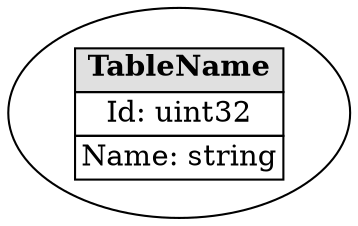

# Visualization

Generate DOT graphs to visualize table structure and relationships between tables.

## Overview

The visualization tool creates DOT format files that can be rendered using Graphviz to show:
- Table structure (fields and types)
- Reference relationships between tables (foreign keys)
- Dependency graphs

## Commands

### Generate DOT File (Append Mode)

```bash
# Generate DOT file for one or more Excel files
python table_tool/table_tool.py visualize excel/File1.xlsx excel/File2.xlsx

# Specify output file
python table_tool/table_tool.py visualize excel/*.xlsx -o tables.dot

# Auto-detect XML config (recommended for mixed client/server tables)
python table_tool/table_tool.py visualize excel/NewFile.xlsx --auto-detect-xml
```

### Generate DOT File (Overwrite Mode)

```bash
# Overwrite existing DOT file
python table_tool/table_tool.py visualize excel/NewFile.xlsx -f

# Overwrite with specified output
python table_tool/table_tool.py visualize excel/NewFile.xlsx -o tables.dot -f
```

### Render to Image

```bash
# Requires Graphviz installed
dot -Tpng tables.dot -o tables.png

# Or use other output formats
dot -Tsvg tables.dot -o tables.svg
dot -Tpdf tables.dot -o tables.pdf
```

### Command Options

| Option | Description |
|--------|-------------|
| `-o FILE` | Specify output file path |
| `-f, --force` | Overwrite mode (replace entire DOT file instead of appending) |
| `--auto-detect-xml` | Auto-detect XML config for each table |

## Append vs Overwrite Mode

### Append Mode (Default)
- Preserves existing tables and edges in the DOT file
- Adds new tables/relationships without removing existing ones
- Use for incremental updates

```bash
python table_tool/table_tool.py visualize excel/NewFile.xlsx
```

### Overwrite Mode
- Replaces the entire DOT file with new content
- Only includes tables/relationships from the specified Excel files
- Use for complete regeneration

```bash
python table_tool/table_tool.py visualize excel/NewFile.xlsx -f
dot -Tpng tables.dot -o tables.png
```

## DOT File Structure

### Table Node Format



### Reference Edge Format

```dot
// Reference from Table1.Field1 to Table2.Id
"Table1" -> "Table2" [label="Field1 -> Id"];
```

## Adding References (Foreign Keys)

### Add Reference Edge

```bash
# Add a reference edge in DOT file
python table_tool/table_tool.py reference \
    --from-table UserLineupSet \
    --from-sheet UserLineupSet \
    --from-field RotationTimeId \
    --to-table RotationInitial \
    --to-sheet Main \
    --to-field Id

# Add with label
python table_tool/table_tool.py reference \
    --from-table UserLineupSet \
    --from-sheet UserLineupSet \
    --from-field RotationTimeId \
    --to-table RotationInitial \
    --to-sheet Main \
    --to-field Id \
    --label "ref"
```

### Reference Command Options

| Option | Description |
|--------|-------------|
| `--from-table` | Source table name |
| `--from-sheet` | Source sheet name |
| `--from-field` | Source field name (foreign key) |
| `--to-table` | Target table name |
| `--to-sheet` | Target sheet name |
| `--to-field` | Target field name (primary key) |
| `--label` | Edge label (optional) |

## Complete Workflow

```bash
# Step 1: Generate DOT file (append mode)
python table_tool/table_tool.py visualize excel/*.xlsx -o doc/tables.dot

# Step 2: Add manual reference edges if needed
python table_tool/table_tool.py reference \
    --from-table UserLineupSet \
    --from-sheet UserLineupSet \
    --from-field RotationTimeId \
    --to-table RotationInitial \
    --to-sheet Main \
    --to-field Id

# Step 3: Render to image
dot -Tpng doc/tables.dot -o doc/tables.png

# Step 4: View the generated image
# (Open tables.png in your image viewer)
```

## Installing Graphviz

### Windows
1. Download from https://graphviz.org/download/
2. Install and add to PATH

### macOS
```bash
brew install graphviz
```

### Linux
```bash
sudo apt-get install graphviz  # Ubuntu/Debian
sudo yum install graphviz      # CentOS/RHEL
```

## Notes

- By default, `visualize` uses append mode which preserves existing table structures and reference edges
- Use `-f` or `--force` to overwrite the entire DOT file
- The DOT file can be manually edited to add custom formatting or labels
